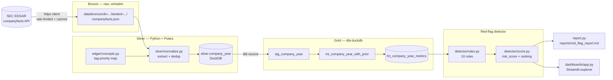
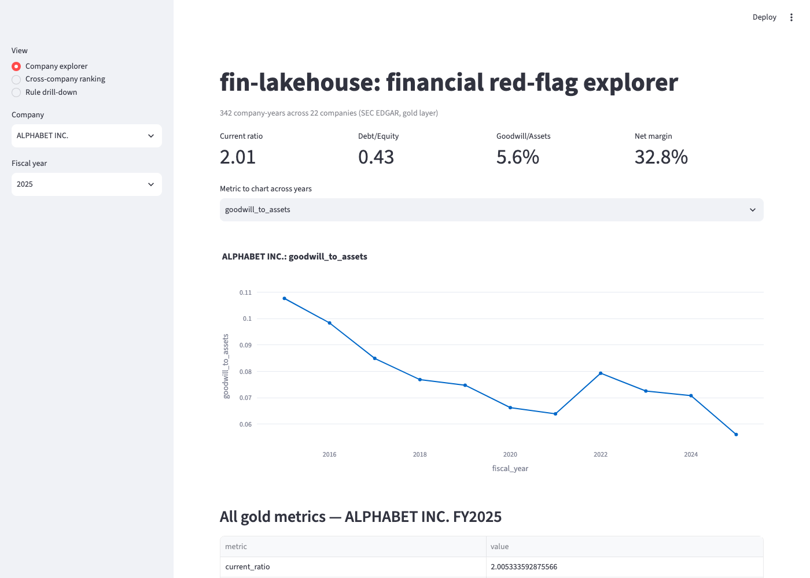
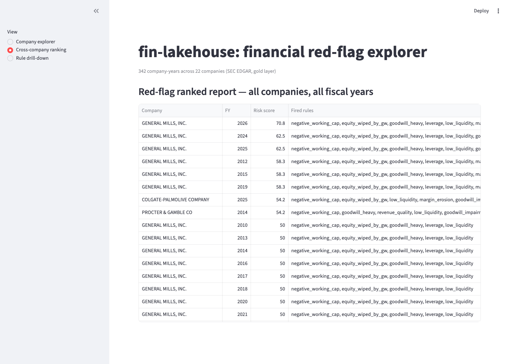
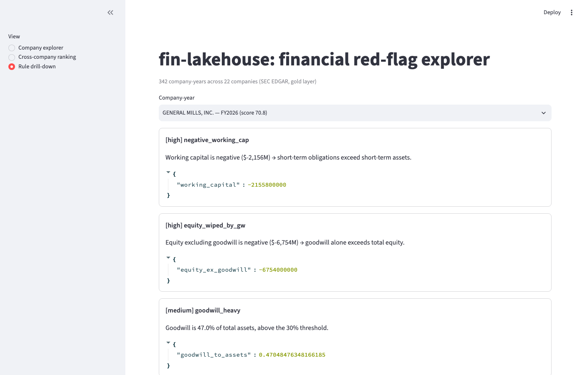

# fin-lakehouse

A local-first, zero-cost financial-statement lakehouse built on **SEC EDGAR + DuckDB + Polars + dbt**,
with a rules-based **red-flag detector** on top that flags deterioration in a company's financials
(goodwill risk, liquidity squeeze, revenue-quality issues, leverage) with a plain-English explanation.

Flagship case study: Kraft Heinz (`KHC`) — the 2018 $7.0B goodwill write-down. Scaled out to a
22-company universe spanning consumer staples, tech, industrials, retail, and telecom.

## Why

Public XBRL filings are messy, inconsistent across companies and years, and hard to compare
without a normalization layer. This project builds that layer end to end: raw filings → tidy
per-company-year facts → analytical ratios → an explainable risk score, with every step
reproducible from a cold clone and every metric backed by a test with an independently-verified
expected value (see `AGENTS.md` for the working agreement, and its milestone log for every real
data-quality bug found and fixed along the way — there were more than a few).

## Architecture



- **Bronze** — raw SEC EDGAR `companyfacts` JSON, landed byte-for-byte verbatim, partitioned by
  `cik` and ingestion date. Never mutated; append-only.
- **Silver** — tag-priority extraction (`docs/PROJECT_BRIEF.md` §5): for each of ~20 financial
  fields, the first available XBRL tag from a priority list wins, deduped across overlapping
  filings by a documented rule (latest period-end, then latest filing date). Missing data is
  logged loudly, never coerced to zero.
- **Gold** — dbt models on dbt-duckdb compute every ratio in §6 (liquidity, cash-conversion-cycle,
  solvency, efficiency, quality, YoY trends), with schema tests and an accounting-identity check
  (`assets = liabilities + equity`, within a relative tolerance).
- **Detector** — a typed table of 10 rules (§7) evaluated per company-year, aggregated into a
  0–100 `risk_score`, each fired rule producing a plain-English explanation with the real numbers.

## The red-flag rules

| rule | fires when | severity |
|---|---|---|
| `negative_working_cap` | working capital < 0 | high |
| `equity_wiped_by_gw` | equity excluding goodwill < 0 | high |
| `goodwill_heavy` | goodwill > 30% of assets | medium |
| `revenue_quality` | DSO up >15% YoY while revenue is flat/down | high |
| `ccc_deterioration` | cash conversion cycle up >20% YoY | medium |
| `leverage` | positive net debt and debt/equity > 2.0x | medium |
| `low_liquidity` | current ratio < 1.0 | medium |
| `margin_erosion` | net margin down >20% YoY (relative) | medium |
| `goodwill_impairment` | any goodwill impairment recognized this period | high |
| `real_revenue_decline` | nominal revenue up, CPI-deflated revenue down | medium |

`risk_score = 100 × (sum of fired rules' severity weights) / (sum of every rule's weight)`,
weights `high=3, medium=2, low=1`. 100 means every rule fired; the denominator is fixed by the
catalogue, so scores are comparable across companies.

`real_revenue_decline` never fires in this build — it needs a CPI deflator table that's out of
scope for v1 (§6); documented as skipped, not faked.

## What the detector actually finds

Run against the real 22-company universe (see `docs/PROJECT_BRIEF.md`'s ticker list, `universe.py`):

- **Kraft Heinz** reproduces the course case study exactly: the FY2018 $7.0B goodwill impairment,
  goodwill consistently 32–37% of assets, and — less obviously — normalized net income (excluding
  the impairment) was *still* negative that year, a real operating problem beyond the write-down.
  The highest-risk KHC years by this rule set are actually FY2022/FY2023 (compounding negative
  working capital, weak liquidity, and CCC deterioration), not the headline FY2018.
- **General Mills** is the highest-risk company in the whole universe — not from one bad year, but
  *structurally*: goodwill has exceeded total equity in every single fiscal year from 2010 to 2026,
  driven substantially by the 2018 Blue Buffalo acquisition, alongside debt-to-equity consistently
  1.9–3.8x.
- **GE, AT&T, Boeing, and Intel** were deliberately included in the universe for their real,
  documented financial stress, and each fires real, defensible flags matching that history.
- Several mature consumer-staples names (PepsiCo, Colgate, P&G) frequently show negative
  working capital and equity-excluding-goodwill — a known characteristic of shareholder-return-
  focused blue-chips running thin book equity from aggressive buybacks, not necessarily distress.
  Noted rather than tuned away, since the rules fire exactly as specified.

## Screenshots

**Company explorer** — pick any company and fiscal year, see every gold metric and a trend chart:



**Cross-company ranking** — the full red-flag report, sortable, across all 342 company-years:



**Rule drill-down** — plain-English explanations with the real observed values behind each flag:



## How to run

```bash
git clone <repo>
cd fin-lakehouse
make setup    # uv sync
make ingest   # pull the full ~20-ticker universe from EDGAR into bronze (live, cached)
make build    # silver normalization + dbt build: silver -> gold
make report   # ranked cross-company red-flag report -> reports/red_flag_report.md
make demo     # Streamlit dashboard at http://localhost:8501
make test     # pytest (ruff/mypy separately via `make lint`)
```

Requires only Python 3.12 (managed via `uv`) and internet access for `make ingest`. No paid cloud
services, no API keys — SEC EDGAR is free and unauthenticated (just requires a descriptive
`User-Agent`, see `.env.example`).

See **`docs/USAGE.md`** for task-oriented how-tos: adding a company, adding a metric, adding a
detector rule, and filtering the report/dashboard down to specific problem areas.

## The Databricks/Delta `prod` seam

The gold layer is plain dbt-duckdb SQL with no engine-specific syntax. `transform/profiles/profiles.yml`
already declares a `prod` target using the `databricks` adapter, selected via `DBT_TARGET=prod`
in `.env`. Promoting to Databricks/Delta needs zero changes to any `.sql` model — only:

1. Add `dbt-databricks` to `pyproject.toml` (not installed by default, to keep the local-first
   `dev` path free of an unused cloud adapter).
2. Set `DATABRICKS_HOST`, `DATABRICKS_HTTP_PATH`, `DATABRICKS_TOKEN`, `DATABRICKS_CATALOG` in `.env`.
3. `silver/load.py`'s `write_company_year` would point at a Delta table (or the silver layer could
   land directly to a Databricks-managed volume) instead of the local DuckDB file — the one place
   silver's `CREATE OR REPLACE TABLE` is DuckDB-specific.

Everything else — the tag-priority extraction, the dedup rules, every gold model, the detector —
is pure Python/SQL with no DuckDB- or Databricks-specific logic.

## Testing philosophy

Every gold metric and every detector rule has a test whose expected value comes from somewhere
*other* than the code under test — a hand-computed number confirmed by a human, or a value derived
by a genuinely independent method. See `AGENTS.md` for the full working agreement; its milestone
log documents every real bug this approach actually caught (a YoY sign-flip on loss-to-profit
recoveries, a stale-schema bug that silently masked two rules never firing, an accounting-identity
gap traced to three different "redeemable noncontrolling interest" XBRL tags across three
companies) — the kind of thing that stays invisible if tests only check that the code agrees with
itself.

```bash
make lint   # ruff check + mypy (strict on edgar/, silver/, detector/)
make test   # pytest — 66+ tests, offline/mocked except the KHC oracle + detector integration tests
cd transform && dbt build --profiles-dir profiles   # schema tests + accounting-identity test
```

CI (`.github/workflows/ci.yml`) runs the full pipeline live against SEC EDGAR for the KHC case
study on every push — deliberately scoped to one ticker to keep CI fast; the full universe is
exercised locally and by offline unit tests that mock the network.

## Status

All 6 milestones complete. See `docs/PROJECT_BRIEF.md` for the full spec and `AGENTS.md` for the
working agreement and a detailed log of what was built, what broke, and how it was fixed at each
milestone.
